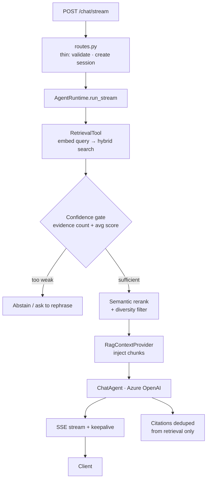

# Agentic RAG API — FastAPI + Azure OpenAI

> A streaming, **agent-orchestrated** RAG backend — hybrid retrieval, a confidence gate that refuses to answer on weak evidence, semantic reranking, and token-by-token SSE streaming. Built on the **Microsoft Agent Framework SDK**.

   


**Stack:** FastAPI · Azure AI Search (hybrid + vector) · Azure OpenAI · Microsoft Agent Framework SDK · Streamlit

---

## Why this exists

A chatbot that confidently answers when it *hasn't* retrieved good evidence is worse than useless in an enterprise — it hallucinates on procedures people act on. This backend puts a **confidence gate** in front of generation: if retrieval evidence is too weak, it declines instead of guessing. That single design choice is what makes agentic RAG trustworthy.

## Why the Agent Framework SDK (not a managed agent service)

A deliberate engineering choice, not a limitation. Using `AzureOpenAIChatClient` + `ChatAgent` + a custom `ContextProvider` directly gives:

- **Full control** of the orchestration loop — the confidence gate, reranking, and diversity filtering live in *our* code, not a black box.
- **Portability** — the same pattern re-targets to AWS Bedrock or a local model without rewriting business logic.
- **Transparency** — every retrieval, score, and gate decision is inspectable and testable.

| SDK primitive | Role |
|---|---|
| `AzureOpenAIChatClient` | LLM connection |
| `client.as_agent()` | Creates the ChatAgent |
| `RagContextProvider(BaseContextProvider)` | Injects retrieved chunks via `before_run()` |
| `InMemoryHistoryProvider` | Multi-turn memory (swap for Cosmos in prod) |
| `agent.run(stream=True)` | Streams tokens into the SSE pipeline |

## Architecture



## Design decisions

- **Confidence gate (score-first)** — abort generation when evidence count or average relevance is below threshold; a single highly-relevant chunk can pass alone.
- **Diversity filter** — cap chunks per source document so one manual can't dominate the context.
- **Citations from retrieval, never from LLM text-mining** — sources are ground truth, not model-generated.
- **Thin route, fat runtime** — HTTP layer stays trivial; all orchestration is isolated and unit-testable.

## Quickstart

```bash
cp .env.example .env          # fill in commercial-Azure values
pip install -r backend/requirements.txt
uvicorn app.main:app --reload # backend on :8000
streamlit run frontend/app.py # UI on :8501
```
Endpoints: `/health`, `/chat` (JSON), `/chat/stream` (SSE). Search setup: [`AZURE_SEARCH_SETUP.md`](AZURE_SEARCH_SETUP.md) · Deploy: [`DEPLOYMENT.md`](DEPLOYMENT.md)

## Evaluation

Agentic systems need **trajectory** evals, not just final-answer scoring:

| metric | what it measures |
|--------|------------------|
| Gate precision/recall | does the confidence gate abstain when it should? |
| Faithfulness | answer grounded in retrieved chunks |
| Context recall | right chunks retrieved before the gate |
| Tool-call correctness | retrieval invoked with the right query |

> Reproduce with the shared harness in [rag-evaluation-harness-python](https://github.com/srikanthot/rag-evaluation-harness-python).

## Production considerations & roadmap

- **Persist history** in Cosmos DB (from `InMemoryHistoryProvider`) for real multi-turn sessions.
- **Human-in-the-loop / kill-switch** node for any action-taking tools.
- **Guardrails** — prompt-injection defense (OWASP LLM06 excessive agency), PII redaction.
- **AWS port** — swap `AzureOpenAIChatClient` → Bedrock and Azure AI Search → OpenSearch behind a provider interface.
- **When *not* to use an agent** — for pure lookup, a single retrieval+generation call is cheaper and faster; agents earn their cost only when multi-step tool use or gating adds real value.

---

